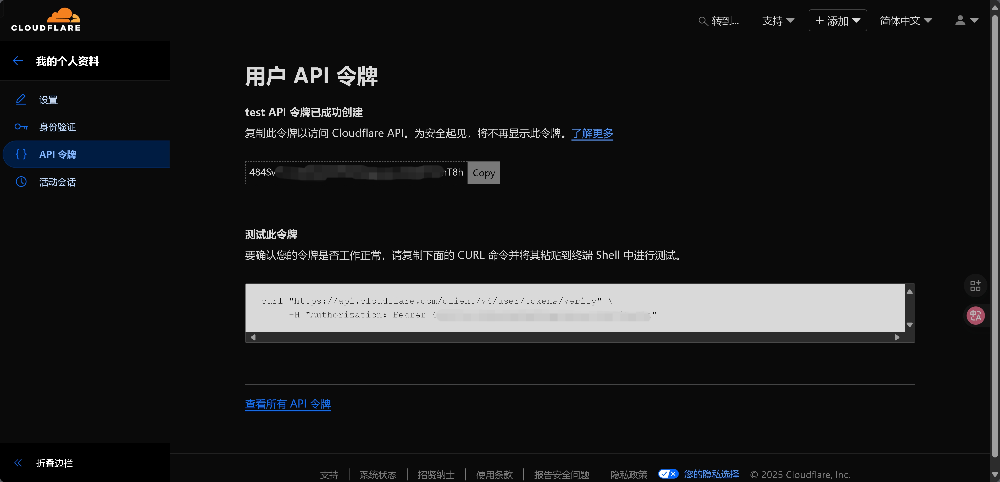

# cloudflare-ddns-rust

这是一个使用rust编写的本人自用 Cloudflare DDNS 脚本，使用了 Rust 高效异步方法构建，速度极快。

## 特点

1. 使用Rust编写，轻量、高效、安全。

2. 大量使用异步 api，io效率极高。

3. 跨平台多种部署方式：
    - Windows 服务（支持暂停服务）
    - Windows 任务计划
    - systemd 服务
    - systemd timer
    - cron
    - Docker
    - 直接使用二进制文件

4. 静态二进制，无 OpenSSL、glibc 等复杂依赖。

## 使用方法

### 创建DNS记录

脚本只能更新 DNS 记录对应的内容，不能自动创建 DNS 记录，请先自行创建 DNS 记录。

创建的类型、名称、地址、TTL 等配置均不影响解析，脚本在解析时会自动转换对应记录。

### 获取 zone id


### 创建 API token

**⚠️出于安全考虑，请不要使用全局API Key，本项目也不支持这种使用方式！**

1. 创建令牌：


2. 选择自定义：


3. 配置 Token


- 权限一栏至少需要 DNS 的读取和编辑权限。
- 区域资源一栏可以选择“所有区域”，也可以只选择你要更新的域名。
- 其他选项根据需要配置。

4. 完成



这就是下面需要用到的 Token，**注意保存这个 Token，今后除非重新生成否则无法再次获取**。

### 获取 dns id

#### 类 Unix 系统请使用 `curl` 执行：

```bash
curl https://api.cloudflare.com/client/v4/zones/<Your Zone ID>/dns_records \
    -H "Authorization: Bearer <Your API Token>"
```

可以获取到如下 json：

```json
{
    "result": [
        {
            "id": "xxxxxxxxxxxxxxxxxxxxxxxxxxxxxxxx",
            "name": "www.example.com",
            "type": "A",
            "content": "0.0.0.0",
            "proxiable": true,
            "proxied": true,
            "ttl": 180,
            "settings": {},
            "meta": {},
            "comment": null,
            "tags": [],
            "created_on": "2000-01-01T00:00:00.000000Z",
            "modified_on": "2000-01-01T00:00:00.000000Z"
        },
        {
            "id": "xxxxxxxxxxxxxxxxxxxxxxxxxxxxxxxx",
            "name": "txt.example.com",
            "type": "TXT",
            "content": "abcdefg",
            "proxiable": false,
            "proxied": false,
            "ttl": 180,
            "settings": {},
            "meta": {},
            "comment": null,
            "tags": [],
            "created_on": "2000-01-01T00:00:00.000000Z",
            "modified_on": "2000-01-01T00:00:00.000000Z"
        }
    ]
}
```

#### Windows 请使用 PowerShell 执行：

```powershell
$headers = @{
    'Authorization' = 'Bearer <Your API Token>'
}

(Invoke-RestMethod -Headers $headers https://api.cloudflare.com/client/v4/zones/<Your Zone ID>/dns_records).result
```

如果您正在使用 PowerShell 6.0+，推荐使用安全字符串方法，系统会提示您输入Token：

```powershell
(Invoke-RestMethod https://api.cloudflare.com/client/v4/zones/<Your Zone ID>/dns_records -Authentication Bearer -Token (Read-Host -AsSecureString "Input API Token")).result
```

可以获取到如下结构：

```
id          : xxxxxxxxxxxxxxxxxxxxxxxxxxxxxxxx
name        : www.example.com
type        : A
content     : 0.0.0.0
proxiable   : True
proxied     : True
ttl         : 180
settings    :
meta        :
comment     :
tags        : {}
created_on  : 2000-01-01T00:00:00.000000Z
modified_on : 2000-01-01T00:00:00.000000Z

id          : xxxxxxxxxxxxxxxxxxxxxxxxxxxxxxxx
name        : txt.example.com
type        : TXT
content     : "abcdefg"
proxiable   : False
proxied     : False
ttl         : 180
settings    :
meta        :
comment     :
tags        : {}
created_on  : 2000-01-01T00:00:00.000000Z
modified_on : 2000-01-01T00:00:00.000000Z
```

即可获得对应需要更新 DNS 的 `id:xxxxxxxxxxxxxxxxxxxxxxxxxxxxxxxx`

### 配置 DDNS

在二进制文件目录创建`data/config.json`，结构如下：

```json
[
    {
        "api_token": "<Your API Token>",
        "zone_id": "<Your Zone ID>",
        "dns_id": "<刚才获取的dns_id>",
        "type": "<A or AAAA，其他类型暂时不支持>",
        "name": "<www.example.com>",
        "ttl": <int>,
        "proxied": <类型为bool,表示是否使用CDN>
    },
    //<可以重复添加更多的记录，同字段配置方法类似>
    {
        "api_token": "",
        "zone_id": "",
        "dns_id": "",
        "type": "",
        "name": "example.com",
        "ttl": 60,
        "proxied": false
    }
]
```

### 安装与运行

绝大多数情况下，推荐使用 `--loops` 方式（服务的本质也是使用`--loops`），这具有单次执行（定时任务的本质是定时执行单次任务）所不具有的优势：

1. 不需要重复初始化网络、日志等资源。
2. 循环模式下脚本会保存 IP 直到发生变化才会进行更新，这不但降低了网络开销，也避免了频繁调用导致超出 Cloudflare API 调用速度限制。
3. 可以保持链接加快网络请求速度。
   
**⚠️`config.json` 仅在启动时加载一次，将在下次重启脚本时生效，如果您确实需要频繁调整 `config.json` 使用 `--once` 或注册为定时任务可能是更好的选择**

#### 要直接执行单次任务，请运行：

```bash
ddns_rust run
```

或者使用等价命令:

```bash
ddns_rust run --once
```

#### 要循环运行任务，请运行：

```bash
ddns_rust run --loops
```
循环周期为1分钟。

#### 要将其安装为服务，请以 root 权限（Windows 管理员权限）运行：

```bash
ddns_rust install service
```
服务的循环周期为1分钟。

- 如果您正在使用Windows，该命令会创建名为`Cloudflare DDNS`的服务，启动方式为“自动（延迟启动）”。

- 如果您正在使用 systemd 作为 init 的 Linux 发行版，该命令会在`/etc/systemd/system/`下创建`cloudflareddns.service`，您需要使用如下命令来启用它：
  
```bash
systemctl enable --now cloudflareddns.service
```

- 如果您正在使用其他非 Systemd 的类 Unix 系统，这条命令依然会尝试创建 `/etc/systemd/system/cloudflareddns.service`，但您可能无法使用该服务。

#### 要将其安装为定时任务，请以 root 权限（Windows 管理员权限）运行：
```bash
ddns_rust install schedule
```
任务的触发周期为2分钟。

- 如果您正在使用Windows，该命令会创建名为`Cloudflare DDNS`的计划任务。

- 如果您正在使用 systemd 作为 init 的 Linux 发行版，该命令会在`/etc/systemd/system/`下创建 `cloudflareddns.service` 与 `cloudflareddns.timer`，您需要使用如下命令来启用它：
```bash
systemctl enable --now cloudflareddns.timer
```

- 如果您正在使用其他非 systemd 的类 Unix 系统，这条命令依然会尝试创建 systemd timer，但您可能无法使用该任务计划。

#### 要将其安装为cron任务，请运行：

```bash
ddns_rust install cron
```
任务的触发周期同样为2分钟。

**⚠️这个命令只有在类 Unix 系统上才可用**，这会将任务添加到用户 cron 列表中。

#### 使用 Docker 运行

本项目支持容器化部署，容器托管在 [Quay.io](https://quay.io/repository/dlysy/cloudflareddns)

Linux 用户命令参考（根据需要自行修改）：

```bash
mkdir /srv/cloudflare-ddns-rust

docker run -d \
-v /srv/cloudflare-ddns-rust/:/app/data \
--network=host \
--restart=always \
--name=cloudflareddns \
quay.io/dlysy/cloudflareddns:linux
```

Windows 用户命令参考：

```powershell
mkdir D:\cloudflare-ddns-rust

docker run -d -v D:\cloudflare-ddns-rust:C:\app\data --restart=always --name=cloudflareddns quay.io/dlysy/cloudflareddns:windows
```

由于 Windows 上的 Docker 无法直接访问宿主机网络，因此需要关注 IPv6 的可用性。

更多关于Windows容器请参考[文档](https://learn.microsoft.com/zh-cn/virtualization/windowscontainers/quick-start/set-up-environment?tabs=dockerce)。

### 日志

无论使用那种方式安装和运行，日志均会存放于二进制文件目录 `data/logs` 下。

控制台也会同步输出日志，Docker 等使用方式应该可以从中受益。

### 卸载

请参考[安装与运行](#安装与运行)章节，将安装的 `install` 命令改成 `uninstall` 即可。

## 命令行参考(施工中)

```bash
ddns_rust --help
```

## 编译

### Windows

由于使用了 Windows 服务相关 Win32API，`cargo target`请使用`*-pc-windows-msvc`，最新版本`msvc`是建议选项（当前为 Visual Studio 2022），使用其他 target（~~`gnu`~~、`gnullvm`）是不建议也不会提供支持的。

*在当前（2025年10月）的 Arch Linux 上使用 `mingw-w64-gcc` 在 `x86_64-pc-windows-gnu` 下进行跨平台编译得到的二进制文件功能完全正常（包括 Service 相关 API 也可以正常运行），但这依然不是推荐的使用方式。*

如果 rust 环境设置正确，从源码编译应该是非常简单的：

```powershell
cargo build --release
```

Windows上默认设置了静态链接选项：

```toml
[target.'cfg(windows)']
rustflags = ["-Ctarget-feature=+crt-static"]
```

这虽然不是 Microsoft 推荐的分发方式，但是作为一款轻量命令行工具，静态编译是必要的。

如果您不需要静态链接，可以在`./.cargo/config.toml`设置为动态链接到vc_runtime：

```toml
[target.'cfg(windows)']
rustflags = ["-Ctarget-feature=-crt-static"]
```

具体请参考[rust手册](https://doc.rust-lang.org/reference/linkage.html)。

### Linux

推荐使用 `musl` 进行静态链接，使用静态链接的好处非常多，比如可以使用 `scratch` 镜像进行构建容器。

反直觉的是，由于 `musl` 本身的轻量化，得到的二进制文件无论内存占用还是文件大小都会比使用 `glibc` 动态链接要小。

**⚠️虽然使用 `musl`，但是请不要在 Alpine Linux 上进行编译，这会得到一个动态链接的 `musl` 二进制文件，在之后的容器编译等步骤将会产生预期外情况⚠️**

如果您坚持使用 `glibc`，这理论上是可行的，但是您将得不到技术上的支持和帮助。

#### 安装 `musl` 工具链

- Ubuntu：

```bash
apt install musl-tools
```

- Arch Linux：

```bash
pacman -S musl
```

#### 配置 rust 工具链

```bash
rustup target add x86_64-unknown-linux-musl
```

#### 编译

```bash
cargo build --release --target x86_64-unknown-linux-musl
```

## 路线图

### TODO

- 优化配置文件，支持调整更新间隔等参数。
- OpenWrt 支持（低优先级，现阶段建议使用[安装为 cron](#要将其安装为cron任务请运行)）
- OpenRC 支持：极低优先级（甚至可能会降级为 [NOT TODO](#not-todo)），Alpine 和 Gentoo 实在没啥人用作，如果你确实需要同样建议[安装为 cron](#要将其安装为cron任务请运行)。

### NOT TODO

- **支持 MX 等其他记录类型**：使用太少，很多记录类型比如 SSHFP、NAPTR 都不太明白具体用途。可能会用得上的就是 MX 记录，MX 记录本身类似于 CNAME 记录需要指向一个域名，所以直接在对应的域名上使用 DDNS 即可。

- **支持Mac**：项目二进制文件可以进行单独的使用，理论上可以配合 cron 使用，但鉴于本人无任何 Mac 设备，故不计划对 Mac 进行测试。

- **支持各种 BSD、SysV、Termux 等其他系统**：这些系统从二进制文件到 init 都十分混乱，理论上来说只要 `Rust` 支持这些系统就可以进行编译，但我不会进行测试。如果您确实需要使用，建议尝试[安装为 cron](#要将其安装为cron任务请运行)。
  
- **支持非 x86_64 架构设备（包括x86_32也不会支持）**：本人无其他架构服务器设备，无法进行测试，但如果你具有相关条件进行测试并发现问题，欢迎提交 PR。
  
- **支持 Windows8.1 及更低版本 Windows**：系统过于老旧，Rust 工具链本身支持有限。

- **监控 `config.json` 以便 `--loops` 模式下无需重启自动读取新配置**：这种非原子操作实现复杂的同时还非常危险；且更新设置后重启是非常常见的设计，综合各种原因不会支持这种用法。这里举个两个栗子：
  1. 你配置写了一半然后按了保存，结果这个写了一半配置不是合法 json，于是整个程序因为无法正确读取而直接崩溃了。
  2. 这个写了一半的配置是合法 json 但字段缺失或类型对不上，这会导致程序内部出现 `null` 而产生各种不可预测的行为。