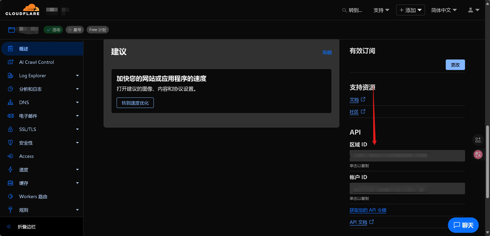
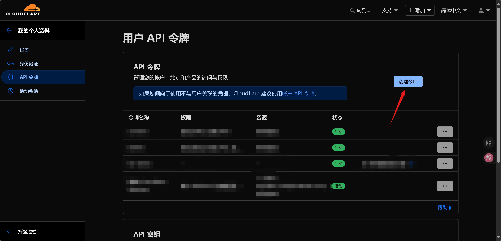
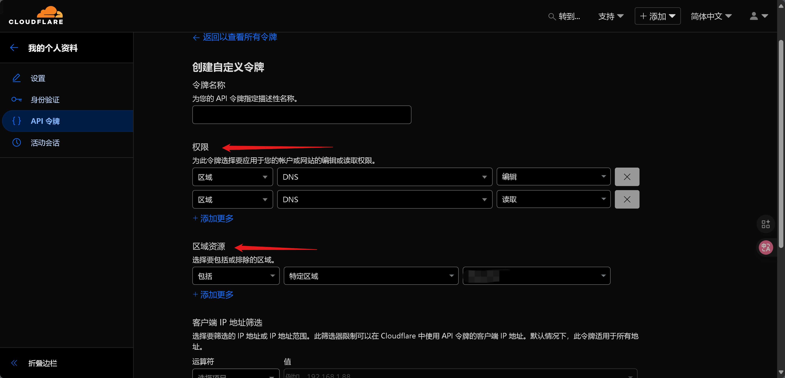

# 配置DNS

脚本默认会读取二进制文件同目录下的 `config.json`，结构如下：

```json
[
    {
        "api_token": "<Your API Token>",
        "zone_id": "<Your Zone ID>",
        "dns_id": "<Your DNS ID>",
        "type": "<A or AAAA，其他类型暂时不支持>",
        "name": "<www.example.com>", //完整域名
        "ttl": <int>,
        "proxied": <类型为bool,表示是否使用CDN>
    },
    //可以重复添加更多的记录，同字段配置方法类似
    {
        "api_token": "",
        "zone_id": "",
        "dns_id": "",
        "type": "",
        "name": "example.com",
        "ttl": 60,
        "proxied": false
    }
]
```

## 获取 Zone ID



## 创建 API Token

!> 出于安全考虑，请不要使用全局API Key，本项目也不支持这种使用方式！

### 创建令牌：



### 选择自定义：


### 配置 Token



- 权限一栏至少需要 DNS 的读取和编辑权限。
- 区域资源一栏可以选择“所有区域”，也可以只选择你要更新的域名。
- 其他选项根据需要配置。

### 完成


这就是下面需要用到的 Token。

?> 注意保存这个 Token，今后除非重新生成否则无法再次获取。

## 获取 DNS ID

### 类 Unix 系统

执行：

```bash
curl https://api.cloudflare.com/client/v4/zones/<Your Zone ID>/dns_records \
    -H "Authorization: Bearer <Your API Token>"
```

可以获取到如下 json：

```json
{
    "result": [
        {
            "id": "xxxxxxxxxxxxxxxxxxxxxxxxxxxxxxxx",
            "name": "www.example.com",
            "type": "A",
            "content": "0.0.0.0",
            "proxiable": true,
            "proxied": true,
            "ttl": 180,
            "settings": {},
            "meta": {},
            "comment": null,
            "tags": [],
            "created_on": "2000-01-01T00:00:00.000000Z",
            "modified_on": "2000-01-01T00:00:00.000000Z"
        },
        {
            "id": "xxxxxxxxxxxxxxxxxxxxxxxxxxxxxxxx",
            "name": "txt.example.com",
            "type": "TXT",
            "content": "abcdefg",
            "proxiable": false,
            "proxied": false,
            "ttl": 180,
            "settings": {},
            "meta": {},
            "comment": null,
            "tags": [],
            "created_on": "2000-01-01T00:00:00.000000Z",
            "modified_on": "2000-01-01T00:00:00.000000Z"
        }
    ]
}
```

即可获得对应需要更新 DNS 的 `id:xxxxxxxxxxxxxxxxxxxxxxxxxxxxxxxx`

### Windows

!> 请务必使用 `PowerShell`，不要使用`命令提示符(CMD)`

使用**PowerShell**执行：

```powershell
$headers = @{
    'Authorization' = 'Bearer <Your API Token>'
}

(Invoke-RestMethod -Headers $headers https://api.cloudflare.com/client/v4/zones/<Your Zone ID>/dns_records).result
```

如果您正在使用 PowerShell 6.0+，推荐使用安全字符串方法，系统会提示您输入Token：

```powershell
(Invoke-RestMethod https://api.cloudflare.com/client/v4/zones/<Your Zone ID>/dns_records -Authentication Bearer -Token (Read-Host -AsSecureString "Input API Token")).result
```

可以获取到如下结构：

```
id          : xxxxxxxxxxxxxxxxxxxxxxxxxxxxxxxx
name        : www.example.com
type        : A
content     : 0.0.0.0
proxiable   : True
proxied     : True
ttl         : 180
settings    :
meta        :
comment     :
tags        : {}
created_on  : 2000-01-01T00:00:00.000000Z
modified_on : 2000-01-01T00:00:00.000000Z

id          : xxxxxxxxxxxxxxxxxxxxxxxxxxxxxxxx
name        : txt.example.com
type        : TXT
content     : "abcdefg"
proxiable   : False
proxied     : False
ttl         : 180
settings    :
meta        :
comment     :
tags        : {}
created_on  : 2000-01-01T00:00:00.000000Z
modified_on : 2000-01-01T00:00:00.000000Z
```

即可获得对应需要更新 DNS 的 `id:xxxxxxxxxxxxxxxxxxxxxxxxxxxxxxxx`